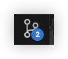

## Simple Visual Studio Code

Newbie Development Team(by darkside)

### 0x00 目标

利用 `vscode` 和 `ssh` 连接到我们安装的虚拟机 , 并且学会利用 `git/github.com` 管理代码 .

约定

1. 命令中的 `<>` 请省略
2. 教程基于 `windows10` `macos15`

### 0x01 下载软件

[vscode](https://code.visualstudio.com/)

这个按安装包直接安装就行 .

### 0x02 安装拓展1

安装完 `vscode` 之后 , 左侧应该有几个图标 , 找到  , 这里就是拓展下载位置 .

安装 `Chinese` , 安装完之后会提示 `reset language and restart` . 做完之后 `vscode` 应该会变成中文界面 .

安装 `Remote - SSH` , 会捆绑安装 3 个包 , 做完之后右侧出现图标 

鼠标悬停在 `ssh` 上 , 点击加号 . 输入完整 `ssh` 命令->输入`ssh`密钥密码 , 稍等一会应该能够成功连接到虚拟机 .

左下角点击  可以呼出一个 `dock` , 点击终端 , 就可以连接到虚拟机的终端 .

### 0x03 安装拓展2

`Ubuntu` 上,类似前面提到的 `open ssh` 和 `vim` 简单的工具可以通过命令 `sudo apt install` 或 `sudo apt-get install` 安装 ,

现在需要安装 

```
sudo apt install git
sudo apt install cmake
```

安装之后,打开拓展的页面,可以对 `ssh` 的远程服务器下载拓展 :

> ```
> C/C++
> CMake Tools
> Code Runner
> Makefile Tools
> Markdown Math
> Markdown PDF (会自动下载Chromium,若下载困难请自行查找解决方法)
> Markdown All in One
> Python
> ```

然后需要简单配置一下 Markdown 相关的插件 .

找到

```
~/.vscode-server/extensions/yzane.markdown-pdf-*/template/template.html
```

`*` 是版本号 .

在末尾添加两行内容 :

```htmp
<script type="text/javascript" src="http://cdn.mathjax.org/mathjax/latest/MathJax.js?config=TeX-AMS-MML_HTMLorMML"></script>
<script type="text/x-mathjax-config"> MathJax.Hub.Config({ tex2jax: {inlineMath: [['$', '$']]}, messageStyle: "none" });</script>
```

### 0x04 安装软件 (选)

软件有相当多种安装方式 , 除了 `apt` 直接安装现成的包 , 还有可能是 

1. 下载安装包进行下载
2. 下载脚本进行下载

比如说 `mihomo-clash` , `g++` . 

不过我都建议先将 **大文件** 在其他地方下载下来 , 通过 `sftp` 传入主机后 , 再进行下载 .

下面是脚本安装 `gcc-14.2.0` 的命令

```bash
sudo apt install build-essential
sudo apt install libmpfr-dev libgmp3-dev libmpc-dev -y
wget http://ftp.gnu.org/gnu/gcc/gcc-14.2.0/gcc-14.2.0.tar.gz # 当前目录下载 , 建议先下载再传入虚拟机 , 然后省略这条命令
tar -xf gcc-14.2.0.tar.gz # 解压

cd gcc-14.2.0
./configure -v --build=x86_64-linux-gnu --host=x86_64-linux-gnu --target=x86_64-linux-gnu --prefix=/usr/local/gcc-14.2.0 --enable-checking=release --enable-languages=c,c++ --disable-multilib --program-suffix=-14.2.0
make -j8 # 意思是用八个线程同时编译
sudo make install
```

### 0x05 `git` 1

利用 `git` , 我们可以低容量成本地管理不同的历史版本 . 不过这里讲的是精简版的 , 如何配合 `github` 进行使用 

1. `git` 全局配置 ( `ssh` 命令行中 )
   
   ```
   git config --global user.name <Your Name>
   git config --global user.email <mail@example.com>
   git config --global credential.helper store
   ```
   
   前两行是个人信息 , 第三行是设置凭证的储存方式 .
   
2. 利用 `vscode/git` 储存文件
   
   点击 `vscode` 左边的图标  .
   
   一开始有两个选项 , 一个是初始化仓库 (如果还没有打开文件夹 , 可以点击这里的打开文件夹 , 作为你的**工作区**) , 另一个是克隆 , 我们先讲初始化仓库 .
   
   初始化仓库完之后 , 在工作区 , 新建一个文件 , 输入内容之后 , 文件名会变绿 右边有个 `U` .
   
   这个字母实际上和命令 `git status` 的效果是一致的 . 
   
   ```
   M(Modified):    表示文件已被修改
   D(Deleted):     表示文件已被删除
   U(Untracked):   表示文件为被追踪
   ...
   ```
   
   这个状态是相对的 , 我们之前有说我们编辑文件的位置是工作区,而 `git` 还有一个额外的区域缓存区 , 这说的就是工作区和缓存区的状态差别 .
   
   你可以通过 `git add` 命令将文件存进缓存区 .
   
   最后利用 `git commit` 命令将缓存区的文件储存进入仓库 .
   
   回到 `vscode` 这里有一个提交按键 , 实际上就是 `commit` .
   
3. 缓存区的作用
   
   缓存区可以让你不那么频繁的创建新的仓库 , 我们希望历史版本都是有效的 . 
   
   同时也可以让你先进行其他任务而不用理会缓存区的更改 (因为撤销可以选择不清空缓存区)
   
   实际上作用对小项目来说 , 作用并不大 , 所以 `vscode` 对缓存区的功能支持较小 .
   
4. 历史版本的仓库
   
   这样操作下 , 我们就会有多个历史版本 , 我们可以回溯到这些历史版本进行工作 
   
   ```
   git revert		创建一个新的提交来撤销之前的提交.
   git reset		回退到某个提交,可以选择保留或丢弃更改.
   git checkout	恢复工作目录中的文件到某个版本.
   ```

5. 克隆
   
   在虚拟机上创建一组密钥对 , 在浏览器中将公钥上传到 `github.com` . 具体请 `搜索引擎` .
   
   然后 在命令行 输入 
   
   ```
   ssh -i ~/.ssh/* git@github.com
   ```
   
   然后你的账号就成功绑定了 github . 然后你就可以尝试命令 :
   
   ```
   git clone <远程仓库的ssh链接>
   ```
   
   另外 , 初始化仓库的命令是 
   
   ```
   git init
   ```

### 0x06 `git` 2

### 附件

`windows` 上的工具链 :

> `msys2`
> 
> `msys2` 是 `msys` 的升级版,结合了 `Cygwin` 的 `POSIX` 兼容层,`MinGW-w64` 的编译工具链以及 `Arch Linux` 的 `pacman` 包管理器.
> 
> 提供完整的类 `Unix` 环境,包括 `Bash shell` 和常用的命令行工具(如 `grep,sed,awk, make` 等).
> 
> 支持多环境开发,包括 `UCRT64`,`MINGW64`,`MINGW32`,`CLANG64` 等,适用于不同架构和运行时环境.
> 
> 使用 `pacman` 包管理器,可以方便地安装,更新和管理开发工具和库.
> 
> 提供丰富的预编译软件包,支持跨平台项目开发.