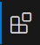

## Simple Visual Studio Code

Newbie Development Team(by darkside)

### 0x00 目标

利用 `vscode` 和 `ssh` 连接到我们安装的虚拟机 , 并且学会利用 `git/github.com` 管理代码 .

约定

1. 命令中的 `<>` 请省略
2. 教程基于 `windows10` `macos15`

### 0x01 下载软件

[vscode](https://code.visualstudio.com/)

这个按安装包直接安装就行 .

### 0x02 安装拓展1

安装完 `vscode` 之后 , 左侧应该有几个图标 , 找到  , 这里就是拓展下载位置 .

安装 `Chinese` , 安装完之后会提示 `reset language and restart` . 做完之后 `vscode` 应该会变成中文界面 .

安装 `Remote - SSH` , 会捆绑安装 3 个包 , 做完之后右侧出现图标 

鼠标悬停在 `ssh` 上 , 点击加号 . 输入完整 `ssh` 命令->输入`ssh`密钥密码 , 稍等一会应该能够成功连接到虚拟机 .

左下角点击  可以呼出一个 `dock` , 点击终端 , 就可以连接到虚拟机的终端 .

### 0x03 安装拓展2

`Ubuntu` 上,类似前面提到的 `open ssh` 和 `vim` 简单的工具可以通过命令 `sudo apt install` 或 `sudo apt-get install` 安装 ,

现在需要安装 

```
sudo apt-get install g++-15
sudo apt install git
sudo apt install cmake
```

安装之后,打开拓展的页面,可以对 `ssh` 的远程服务器下载拓展 :

> ```
> C/C++
> CMake Tools
> Code Runner
> Makefile Tools
> Markdown Math
> Markdown PDF (会自动下载Chromium,若下载困难请自行查找解决方法)
> Markdown All in One
> Python
> ```

### 附件

`windows` 上的工具链 :

> `msys2`
> 
> `msys2` 是 `msys` 的升级版,结合了 `Cygwin` 的 `POSIX` 兼容层,`MinGW-w64` 的编译工具链以及 `Arch Linux` 的 `pacman` 包管理器.
> 
> 提供完整的类 `Unix` 环境,包括 `Bash shell` 和常用的命令行工具(如 `grep,sed,awk, make` 等).
> 
> 支持多环境开发,包括 `UCRT64`,`MINGW64`,`MINGW32`,`CLANG64` 等,适用于不同架构和运行时环境.
> 
> 使用 `pacman` 包管理器,可以方便地安装,更新和管理开发工具和库.
> 
> 提供丰富的预编译软件包,支持跨平台项目开发.