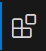

## Simple Visual Studio Code

Newbie Development Team(by darkside)

### 0x00 目标

利用 `vscode` 和 `ssh` 连接到我们安装的虚拟机 , 并且学会利用 `git/github.com` 管理代码 .

约定

1. 命令中的 `<>` 请省略
2. 教程基于 `windows10` `macos15`

### 0x01 下载软件

[vscode](https://code.visualstudio.com/)

这个也是按安装包直接安装就行 .

|windows|macos|
|-|-|
|[msysgit](https://git-scm.com/downloads/win)|`brew install git`|

> `msys`:
> 
> `msys` 是一个轻量级的命令行环境,旨在为 `Windows` 提供基本的 `Unix/Linux` 命令行工具.它是 `Cygwin` 的简化版,专注于提供最小化的 `POSIX` 兼容环境.
> 
> 功能:
> 提供了基本的 `Unix` 工具(如 `bash,make,grep` 等),用于辅助 `MinGW(Minimalist GNU for Windows)` 进行命令行开发.
> 
> 支持在 `Windows` 上编译和运行原生 `Windows` 程序,无需依赖 `Cygwin` 的中间层.
> 适合开发不需要复杂 `POSIX` 功能的项目.
> 
> `msys2`
> 
> 定义:`msys2` 是 `msys` 的升级版,结合了 `Cygwin` 的 `POSIX` 兼容层,`MinGW-w64` 的编译工具链以及 `Arch Linux` 的 `pacman` 包管理器.
> 
> 功能:
> 提供完整的类 `Unix` 环境,包括 `Bash shell` 和常用的命令行工具(如 `grep,sed,awk, make` 等).
> 支持多环境开发,包括 `UCRT64`,`MINGW64`,`MINGW32`,`CLANG64` 等,适用于不同架构和运行时环境.
> 使用 `pacman` 包管理器,可以方便地安装,更新和管理开发工具和库.
> 提供丰富的预编译软件包,支持跨平台项目开发.

### 0x02 安装拓展1

安装完 `vscode` 之后 , 左侧应该有几个图标 , 找到  , 这里就是拓展下载位置 .

安装 `Chinese` , 安装完之后会提示 `reset language and restart` . 做完之后 `vscode` 应该会变成中文界面 .

安装 `Remote - SSH` , 会捆绑安装 3 个包 , 做完之后右侧出现图标 